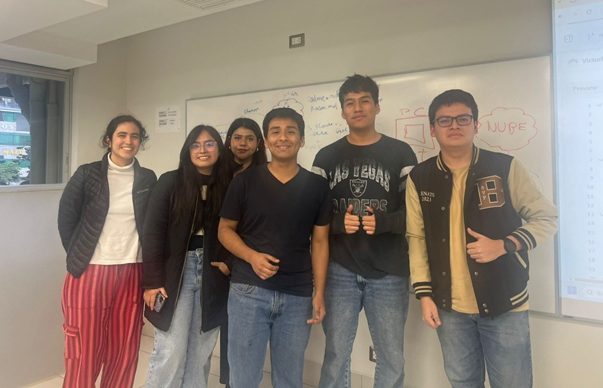
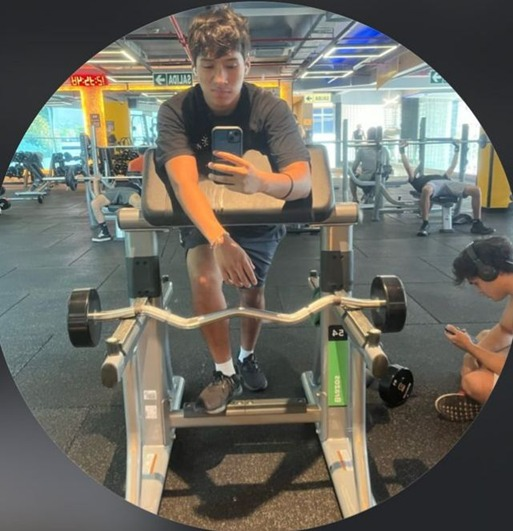
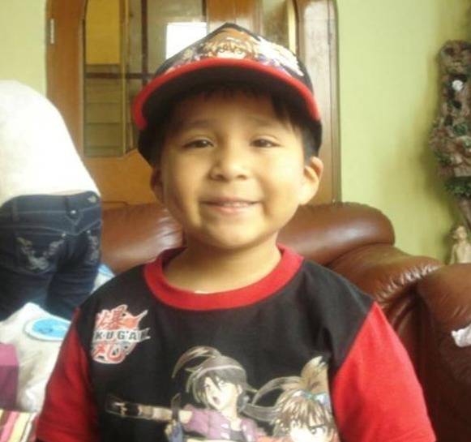
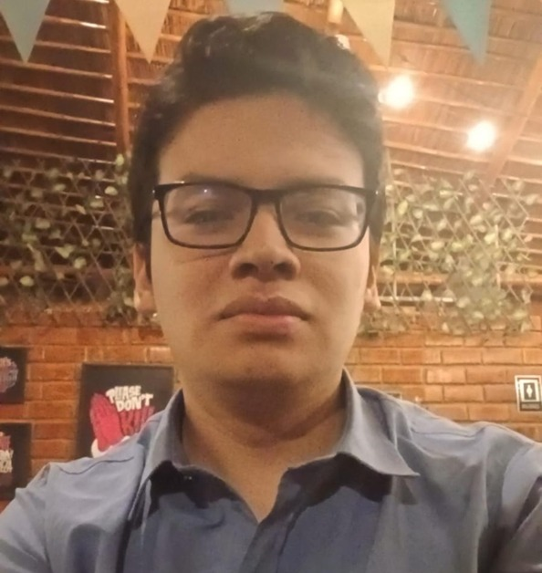
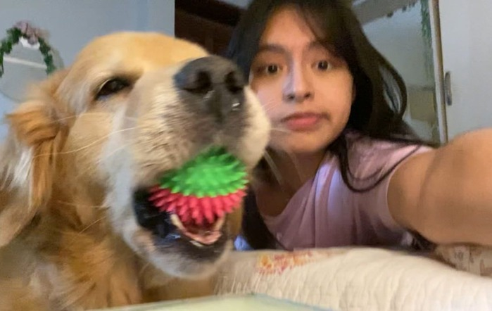
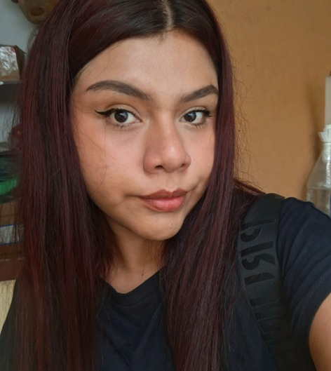
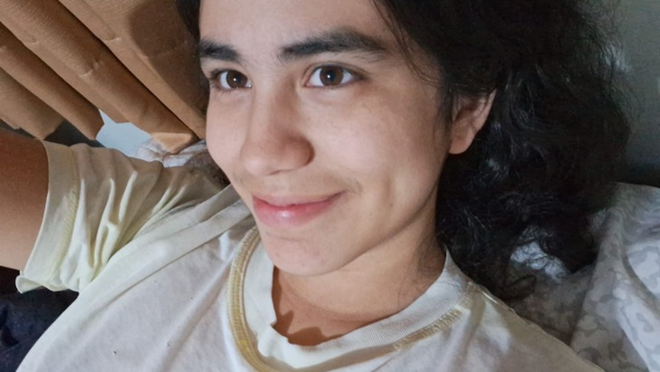

  

---

<b>
 FUNDAMENTOS DE BIODISEÑO 2025-2 </b>
<h1>
 EQUIPO 6 
</h1>

# 📌 Presentación del Equipo

Bienvenidos a la presentación oficial de nuestro equipo.  
Aquí encontrarás información sobre cada integrante, sus roles y responsabilidades.  

---

## 📸 Foto Grupal

  

---

## 👥 Integrantes

### 🧑 Joaquin Alfredo Arrunategui Vila

- **Edad:** 18 años  
- **Sobre mí:** texto1  
- **Rol:** Programador  
- **Responsabilidades:**  
  - Desarrollar la lógica central del sistema.  
  - Implementar funciones y depurar errores.
  - Integrar software con la parte electrónica

---

### 🧑 Ricardo Junior Chavesta Plasencia

- **Edad:** 18 años  
- **Sobre mí:** texto2  
- **Rol:** Ensamble  
- **Responsabilidades:**  
  - Montar y ensamblar las diferentes partes del prototipo.  
  - Integrar piezas electrónicas, 3D y estructurales.
  - Asegurar la estabilidad y funcionamiento general del dispositivo.

---

### 🧑 Renato Almeyda Ochoa

- **Edad:** 18 años  
- **Sobre mí:** texto3  
- **Rol:** Electrónica  
- **Responsabilidades:**  
  - Diseñar y desarrollar el sistema eléctrico/electrónico del prototipo.
  - Seleccionar y conectar sensores, actuadores y placas.
  - Verificar el correcto funcionamiento de los circuitos.

---

### 👩 Angélica Gabriela Campos Zapata

- **Edad:** 18 años  
- **Sobre mí:** texto4  
- **Rol:** Investigación y documentación + Repositorio  
- **Responsabilidades:**  
  - Buscar y Analizar información científica/técnica relevante..  
  - Redactar README, informes y presentaciones.
  - Mantener actualizado y organizado el repositorio en GitHub.

---

### 👩 Criss Susan Castro Lozano

- **Edad:** 18 años  
- **Sobre mí:** texto5  
- **Rol:** Validación y pruebas
- **Responsabilidades:**  
  - Realizar pruebas funcionales del sistema.
  - Evaluar el rendimiento y registrar resultados.
  - Retroalimentar al equipo para mejorar el prototipo.

---

### 👩 Sarai Louise Castro Saenz

- **Edad:** 18 años  
- **Sobre mí:** texto6  
- **Rol:** Diseño y modelado 3D 
- **Responsabilidades:**  
  - Elabora modelos tridimensionales en software CAD.
  - Optimizar piezas para impresión o prototipado físico.
  - Colaborar en la integración mecánica del dispositivo.

---
